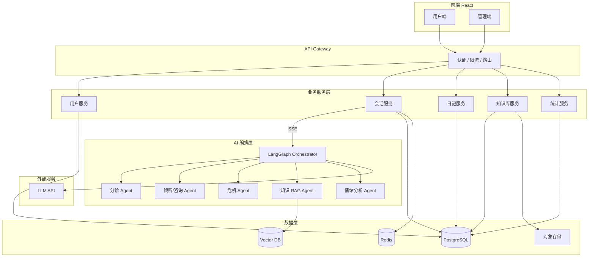
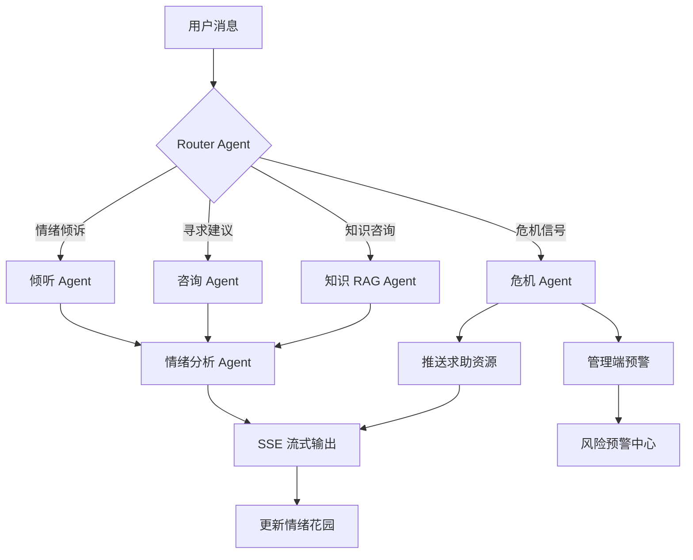

# MindHug 项目重构与完善报告

> 基于当前代码库分析，结合「自建后端 + 多智能体编排 + 前后端全面优化」的目标撰写。
>
> 文档版本：v1.0  
> 更新日期：2026-09-01

---

## 目录

- [零、现状诊断](#零现状诊断重构起点)
- [一、项目最终形态](#一项目最终形态)
- [二、实现整个项目的完整流程](#二实现整个项目的完整流程)
- [三、后续实现 Plan](#三后续实现-plan)
- [四、总结](#四总结)

---

## 零、现状诊断（重构起点）

在规划最终形态之前，先明确当前项目的真实状态与不足：

| 维度 | 现状 | 问题 |
|------|------|------|
| **后端** | 依赖外部服务 `159.75.169.224:1235`，仓库无后端代码 | 不可控、不可扩展、随时可能失效 |
| **AI 能力** | 单一「宁渡AI助手」，黑盒调用 | 无法定制 Prompt、无法做多 Agent 编排 |
| **前端架构** | `Consultation.tsx` 等组件 500+ 行，逻辑/UI 耦合 | 难维护、难测试 |
| **配置管理** | API 地址、静态资源硬编码 | 无法区分 dev/staging/prod |
| **用户体验** | 首页 CTA 按钮无跳转；未登录无法使用咨询 | 转化路径断裂 |
| **安全合规** | 心理危机仅有 UI 展示，无固定干预流程 | 心理健康场景风险高 |
| **工程化** | 无测试、无 CI/CD、无 `.env` | 质量无法保障 |

**重构核心目标**：从「依赖他人 API 的前端 Demo」→「自主可控的 AI 心理健康服务平台」。

---

## 一、项目最终形态

### 1.1 产品定位

**MindHug（心语陪伴）** — 面向个人用户与机构管理员的 **AI 驱动心理健康陪伴平台**。

- **对用户**：提供 7×24 情绪倾诉、AI 心理咨询、情绪日记、心理知识学习
- **对管理员**：提供用户行为洞察、风险预警、内容运营、Agent 配置管理
- **对开发者/学习者**：作为多智能体编排（Multi-Agent Orchestration）的实战项目

### 1.2 应用场景

| 场景 | 描述 |
|------|------|
| 日常情绪陪伴 | 用户感到焦虑/孤独时，与 AI 倾诉，获得共情与建议 |
| 情绪自我觉察 | 通过日记记录 + AI 分析，追踪情绪变化趋势 |
| 心理知识学习 | 阅读科普文章，AI 基于知识库回答相关问题（RAG） |
| 危机早期识别 | 系统识别高风险表达，触发预警与求助引导 |
| 机构运营管理 | 管理员查看整体情绪趋势、干预高风险用户、运营内容 |
| 技术学习/展示 | 演示多 Agent 协作、流式对话、情绪分析 Pipeline |

### 1.3 目标用户

| 角色 | 描述 | 核心诉求 |
|------|------|----------|
| **普通用户** | 有情绪倾诉、自我觉察需求的个人 | 温暖、安全、隐私、有效 |
| **管理员/运营** | 平台运营者、心理咨询师（督导） | 数据洞察、风险管控、内容管理 |
| **开发者** | 学习 Agent 开发的学习者 | 可观测、可配置、架构清晰 |

### 1.4 最终功能架构

```
MindHug 平台
│
├── 用户端（C 端）
│   ├── 首页与引导
│   ├── AI 多智能体咨询（核心）
│   │   ├── 分诊 Agent：识别意图（倾诉/咨询/危机/知识）
│   │   ├── 倾听 Agent：共情回应、情绪安抚
│   │   ├── 咨询 Agent：认知引导、建议输出
│   │   ├── 危机 Agent：风险识别、求助资源推送
│   │   └── 知识 Agent：RAG 检索回答
│   ├── 情绪花园（实时情绪可视化）
│   ├── 情绪日记（记录 + AI 分析 + 历史回顾）
│   ├── 心理知识库（分类浏览 + 搜索 + 收藏）
│   └── 个人中心（资料、历史、设置）
│
├── 管理端（B 端）
│   ├── 数据仪表盘（用户/会话/情绪趋势）
│   ├── 咨询记录管理（查看、标注、导出）
│   ├── 情绪日记管理（筛选、AI 分析结果查看）
│   ├── 知识库 CMS（文章/分类 CRUD）
│   ├── 风险预警中心（高风险用户列表、处理状态）
│   └── Agent 配置（Prompt 管理、模型选择、编排规则）
│
└── 后端服务
    ├── API Gateway（认证、限流、路由）
    ├── 业务服务（用户/会话/日记/文章/统计）
    ├── AI 编排引擎（LangGraph 多 Agent 调度）
    ├── 向量检索服务（知识库 RAG）
    └── 基础设施（PostgreSQL、Redis、对象存储、消息队列）
```

### 1.5 核心技术特征（区别于现状）

| 特征 | 现状 | 目标形态 |
|------|------|----------|
| 后端 | 外部黑盒 API | 自研 FastAPI 服务，完全可控 |
| AI | 单 Agent 直连 | LangGraph 多 Agent 编排，可观测 |
| 知识 | 静态文章列表 | RAG 增强，AI 可引用知识库回答 |
| 情绪分析 | 会话结束后单次调用 | 实时 + 事后双层分析，日记联动 |
| 危机处理 | 仅 UI 展示 | 规则引擎 + 固定干预流程 + 管理端预警 |
| 前端 | 大组件、硬编码 | 模块化、环境变量、响应式、可测试 |
| 部署 | 依赖他人服务器 | Docker Compose / 云部署，一键启动 |

### 1.6 系统架构图（目标）



### 1.7 推荐技术栈

```
后端:     Python 3.11+ / FastAPI
ORM:      SQLAlchemy 2.0 + Alembic
数据库:   PostgreSQL 15
缓存:     Redis 7
AI 编排:  LangGraph + LangChain
向量库:   pgvector（初期）/ Qdrant（后期）
LLM:      DeepSeek / 通义千问 / OpenAI（可切换）
前端:     React 19 + Vite + Ant Design 6
部署:     Docker Compose → 云服务器
```

---

## 二、实现整个项目的完整流程

### 2.1 总体流程（6 个阶段）

```
Phase 0: 准备与规划
    ↓
Phase 1: 后端基础 + API 复现
    ↓
Phase 2: 前端解耦 + 对接新后端
    ↓
Phase 3: 单 Agent AI 能力上线
    ↓
Phase 4: 多 Agent 编排 + RAG
    ↓
Phase 5: 体验优化 + 安全合规 + 部署上线
```

### 2.2 各阶段详细流程

#### Phase 0：准备与规划（1 周）

**目标**：确立技术方案，搭建开发环境，梳理接口契约。

| 步骤 | 内容 | 产出 |
|------|------|------|
| 0.1 | 确定技术栈 | 技术选型文档 |
| 0.2 | 梳理现有 API 契约 | OpenAPI / 接口对照表 |
| 0.3 | 设计数据库 ER 图 | 数据库设计文档 |
| 0.4 | 设计多 Agent 编排流程 | Agent 架构图 |
| 0.5 | 搭建 monorepo 或双仓库结构 | 项目骨架 |
| 0.6 | 配置 `.env`、Docker 开发环境 | `docker-compose.dev.yml` |

---

#### Phase 1：后端基础 + API 复现（3–4 周）

**目标**：自建后端，100% 复现现有前端所需的 API，替换外部依赖。

```
Week 1: 项目骨架 + 用户模块
├── FastAPI 项目初始化
├── 数据库模型（User, Role）
├── JWT 认证（login / register / logout）
└── 统一响应格式 { code, data, msg, success }

Week 2: 会话模块
├── Session, Message 模型
├── 会话 CRUD API
├── 消息历史查询
└── SSE 流式接口骨架（先返回 mock 流）

Week 3: 业务模块
├── 情绪日记 CRUD
├── 知识库（分类树 + 文章 CRUD）
├── 文件上传（本地/MinIO）
└── 数据统计聚合接口

Week 4: 联调与修正
├── 用 Postman/httpx 测试全部接口
├── 对齐前端 types 定义
└── 编写 API 文档（Swagger 自动生成）
```

**关键 API 清单**（需与现有 `src/apis/` 对齐）：

| 模块 | 接口 | 方法 |
|------|------|------|
| 用户 | `/user/login` | POST |
| 用户 | `/user/register` | POST |
| 用户 | `/user/logout` | POST |
| 会话 | `/psychological-chat/sessions` | GET |
| 会话 | `/psychological-chat/session/start` | POST |
| 会话 | `/psychological-chat/sessions/{id}/messages` | GET |
| 会话 | `/psychological-chat/sessions/{id}` | DELETE |
| 会话 | `/psychological-chat/stream` | POST (SSE) |
| 会话 | `/psychological-chat/session/{id}/emotion` | GET |
| 日记 | `/emotion-diary` | POST |
| 日记 | `/emotion-diary/admin/page` | GET |
| 日记 | `/emotion-diary/admin/{id}` | DELETE |
| 知识库 | `/knowledge/category/tree` | GET |
| 知识库 | `/knowledge/article/page` | GET |
| 知识库 | `/knowledge/article` | POST |
| 知识库 | `/knowledge/article/{id}` | GET/PUT/DELETE |
| 统计 | `/data-analytics/overview` | GET |
| 文件 | `/file/upload` | POST |

---

#### Phase 2：前端解耦 + 对接新后端（2–3 周）

**目标**：重构前端架构，切换到自己的后端，修复现有 UX 问题。

```
Week 1: 基础设施改造
├── 引入 .env（VITE_API_BASE_URL）
├── 移除硬编码 IP（config、KnowledgeBase、BackLayout）
├── vite.config.ts 代理指向本地后端
└── 统一 ApiResponse 类型处理

Week 2: 组件拆分
├── Consultation.tsx → 拆分为:
│   ├── SessionList（会话列表）
│   ├── ChatWindow（对话区）
│   ├── EmotionGarden（情绪花园）
│   ├── MessageInput（输入区）
│   └── hooks/useChatStream（SSE 逻辑）
├── 抽取通用组件（Loading、ErrorBoundary、Empty）
└── 补充全局 loading / toast 处理

Week 3: UX 修复与增强
├── 首页 CTA 按钮添加路由跳转
├── 未登录用户可浏览知识库，咨询引导登录
├── 响应式布局（移动端适配）
├── 个人中心页面（历史日记、会话概览）
└── 前后端联调，修复接口差异
```

---

#### Phase 3：单 Agent AI 能力上线（2 周）

**目标**：接入真实 LLM，实现可用的 AI 咨询对话。

```
Week 1: LLM 集成
├── 封装 LLM 调用层（支持多模型切换）
├── 设计心理咨询 System Prompt
├── 实现上下文管理（最近 N 轮对话）
├── SSE 流式输出对接 LangChain streaming
└── 消息持久化（用户消息 + AI 回复）

Week 2: 情绪分析
├── 设计情绪分析 Prompt（输出结构化 JSON）
├── 对齐 emotionAnalysType 字段
├── 会话结束后触发分析 + 存入数据库
├── 日记提交后异步 AI 分析
└── 前端情绪花园对接真实数据
```

**情绪分析输出结构**（保持与现有前端 `src/types/sessionsType.ts` 兼容）：

```json
{
  "primaryEmotion": "焦虑",
  "emotionScore": 0.72,
  "isNegative": true,
  "riskLevel": 2,
  "keywords": ["压力", "失眠"],
  "suggestion": "建议尝试深呼吸放松...",
  "icon": "😟",
  "label": "轻度焦虑",
  "riskDescription": "检测到负面情绪，建议关注自身状态",
  "improvementSuggestions": ["每天散步15分钟", "记录三件好事"]
}
```

---

#### Phase 4：多 Agent 编排 + RAG（3–4 周）

**目标**：引入多智能体协作，知识库 RAG 增强。

```
Week 1: Agent 基础架构
├── LangGraph 状态机设计
├── 定义 AgentState（messages, emotion, risk_level, active_agent）
├── 实现 Router Agent（意图分类）
└── Agent 执行日志与 tracing

Week 2: 核心 Agent 实现
├── 倾听 Agent（共情、复述、安抚）
├── 咨询 Agent（认知重构、建议）
├── 危机 Agent（关键词 + LLM 双重检测）
│   └── 固定输出：心理援助热线、紧急求助指引
└── Agent 间 handoff 逻辑

Week 3: RAG 知识库
├── 文章向量化（embedding + pgvector）
├── 检索 Pipeline（query → top-k → rerank）
├── 知识 Agent（基于检索结果回答）
└── 前端：AI 回答中标注引用来源

Week 4: 管理端 Agent 配置
├── Prompt 模板管理（后台可编辑）
├── 模型选择与参数配置
├── Agent 执行日志查看
└── 风险预警中心（高风险用户列表）
```

**多 Agent 编排流程**：



---

#### Phase 5：体验优化 + 安全合规 + 部署（2–3 周）

**目标**：打磨产品体验，满足基本合规要求，可部署运行。

```
Week 1: 体验优化
├── 对话中断线重连
├── 消息发送失败重试
├── 骨架屏 / 加载动画
├── 暗色模式（可选）
└── 无障碍基础支持

Week 2: 安全与合规
├── 用户协议 + 隐私政策页面
├── AI 免责声明（非专业心理咨询）
├── 危机干预固定流程（热线 400-161-9995 等）
├── 敏感数据加密存储
├── 接口限流（防滥用）
└── 日志脱敏

Week 3: 部署与工程化
├── Docker Compose 一键部署
├── GitHub Actions CI（lint + test + build）
├── 环境分离（dev / staging / prod）
├── README 完善（部署文档、架构说明）
└── 基础单元测试 + API 集成测试
```

---

### 2.3 数据流示意（核心咨询流程）

```
用户输入 "最近压力很大，睡不着"
        │
        ▼
┌─ 前端 Consultation ─────────────────────────┐
│  1. 乐观更新 UI（用户消息）                   │
│  2. POST /psychological-chat/stream (SSE)    │
└────────────────────┬──────────────────────────┘
                     │
                     ▼
┌─ 后端 Session Service ────────────────────────┐
│  3. 鉴权 → 保存用户消息到 DB                  │
│  4. 调用 LangGraph Orchestrator              │
└────────────────────┬──────────────────────────┘
                     │
                     ▼
┌─ LangGraph ───────────────────────────────────┐
│  5. Router Agent → 意图: "情绪倾诉+求助"      │
│  6. 倾听 Agent → 共情回应（流式）             │
│  7. 咨询 Agent → 睡眠建议（流式）             │
│  8. 情绪分析 Agent → 焦虑, riskLevel=2       │
│  9. 保存 AI 消息 + 情绪结果到 DB              │
└────────────────────┬──────────────────────────┘
                     │ SSE chunks
                     ▼
┌─ 前端 ────────────────────────────────────────┐
│  10. 逐字渲染 AI 回复                           │
│  11. onclose → 刷新情绪花园                   │
│  12. 若 riskLevel > 1 → 显示温馨提醒          │
└───────────────────────────────────────────────┘
```

---

## 三、后续实现 Plan

### 3.1 里程碑总览

| 里程碑 | 时间 | 交付物 | 验收标准 |
|--------|------|--------|----------|
| **M0: 项目启动** | 第 1 周 | 技术方案、DB 设计、项目骨架 | 本地可 `docker-compose up` |
| **M1: 后端 MVP** | 第 2–5 周 | 全部 API 可用（AI 为 mock） | Postman 测试全通过 |
| **M2: 前端重构** | 第 5–7 周 | 前端对接新后端，组件拆分完成 | 现有功能全部可用 |
| **M3: AI 上线** | 第 8–9 周 | 真实 LLM 对话 + 情绪分析 | 流式对话流畅，情绪花园有数据 |
| **M4: 多 Agent** | 第 10–13 周 | 多 Agent 编排 + RAG | 不同意图路由到不同 Agent |
| **M5: 产品化** | 第 14–16 周 | 安全合规 + 部署 + 文档 | Docker 一键部署，有测试 |

**总工期预估：约 4 个月**（个人开发者，兼职投入）

---

### 3.2 分 Sprint 计划（2 周一个 Sprint）

#### Sprint 1（W1–W2）：地基

- [ ] 创建 `backend/` 后端目录（或 monorepo）
- [ ] FastAPI 项目初始化 + Docker Compose（PG + Redis）
- [ ] 数据库模型：User, Role
- [ ] JWT 认证：login / register / logout
- [ ] 前端：引入 `.env`，移除硬编码 IP
- [ ] 编写接口对照表文档

#### Sprint 2（W3–W4）：会话核心

- [x] 数据库模型：Session, Message
- [x] 会话 CRUD API（对齐现有前端 types）
- [x] SSE 流式接口（mock 响应）
- [x] 前端 `Consultation.tsx` 对接新后端联调
- [x] 消息历史加载验证

#### Sprint 3（W5–W6）：业务模块

- [ ] 情绪日记 API（用户提交 + 管理端分页）
- [ ] 知识库 API（分类树 + 文章 CRUD）
- [ ] 文件上传（MinIO 或本地存储）
- [ ] 数据统计 API（仪表盘数据）
- [ ] 前端：Diary、KnowledgeBase、DashBoard 联调

#### Sprint 4（W7–W8）：前端重构

- [ ] `Consultation.tsx` 拆分为 5+ 子组件
- [ ] 抽取 `useChatStream` hook
- [ ] 首页 CTA 跳转修复
- [ ] 个人中心页面（基础版）
- [ ] ErrorBoundary + 全局 Loading
- [ ] 管理端全部页面对接新后端

#### Sprint 5（W9–W10）：AI 单 Agent

- [ ] LLM 调用层封装（DeepSeek / 通义）
- [ ] 心理咨询 System Prompt 设计与迭代
- [ ] SSE 真实流式输出
- [ ] 上下文管理（滑动窗口）
- [ ] 情绪分析 Pipeline（结构化输出）
- [ ] 日记 AI 分析（异步任务）

#### Sprint 6（W11–W12）：多 Agent 基础

- [ ] LangGraph 状态机搭建
- [ ] Router Agent（意图分类：倾诉/咨询/危机/知识）
- [ ] 倾听 Agent + 咨询 Agent 实现
- [ ] 危机 Agent（关键词规则 + LLM 检测）
- [ ] Agent 执行日志

#### Sprint 7（W13–W14）：RAG + 管理增强

- [ ] 文章向量化 + pgvector 检索
- [ ] 知识 RAG Agent
- [ ] 管理端：风险预警中心
- [ ] 管理端：Prompt 配置页面
- [ ] 前端：AI 回答引用标注

#### Sprint 8（W15–W16）：产品化

- [ ] 用户协议 + 免责声明
- [ ] 危机干预固定流程
- [ ] 接口限流 + 日志脱敏
- [ ] Docker Compose 生产配置
- [ ] GitHub Actions CI
- [ ] 基础测试（API 集成测试）
- [ ] README + 部署文档完善

---

### 3.3 项目目录结构（目标）

```
mindHug/
├── frontend/                    # 现有 React 前端（迁移整理）
│   ├── src/
│   │   ├── apis/
│   │   ├── components/
│   │   │   ├── chat/            # 咨询相关组件（拆分后）
│   │   │   ├── diary/
│   │   │   ├── knowledge/
│   │   │   └── common/          # 通用组件
│   │   ├── hooks/               # useChatStream 等
│   │   ├── pages/
│   │   ├── store/
│   │   ├── types/
│   │   └── utils/
│   ├── .env.development
│   ├── .env.production
│   └── package.json
│
├── backend/                     # 新建 FastAPI 后端
│   ├── app/
│   │   ├── api/                 # 路由层
│   │   │   ├── auth.py
│   │   │   ├── sessions.py
│   │   │   ├── diary.py
│   │   │   ├── knowledge.py
│   │   │   ├── analytics.py
│   │   │   └── files.py
│   │   ├── agents/              # 多 Agent 编排
│   │   │   ├── graph.py         # LangGraph 主图
│   │   │   ├── router.py
│   │   │   ├── listener.py
│   │   │   ├── counselor.py
│   │   │   ├── crisis.py
│   │   │   ├── knowledge.py
│   │   │   └── emotion.py
│   │   ├── models/              # SQLAlchemy 模型
│   │   ├── schemas/             # Pydantic 请求/响应
│   │   ├── services/            # 业务逻辑
│   │   ├── core/                # 配置、安全、依赖
│   │   └── main.py
│   ├── alembic/                 # 数据库迁移
│   ├── tests/
│   ├── requirements.txt
│   └── Dockerfile
│
├── docs/                        # 项目文档
│   └── PROJECT_PLAN.md          # 本文档
├── docker-compose.yml           # 一键启动全套服务
├── docker-compose.dev.yml
└── README.md
```

---

### 3.4 风险与应对

| 风险 | 概率 | 影响 | 应对策略 |
|------|------|------|----------|
| LLM API 成本超预期 | 中 | 中 | 设置 token 上限、用小模型做路由/分析 |
| 多 Agent 延迟过高 | 高 | 高 | 路由用小模型；倾听/咨询可并行；全程 SSE |
| 心理危机处理不当 | 低 | 极高 | 规则引擎兜底 + 固定求助资源 + 人工复核机制 |
| 前后端接口不一致 | 中 | 中 | 以现有 `types/` 为契约，后端 Pydantic 对齐 |
| 个人开发周期过长 | 中 | 中 | 严格按 Sprint 交付，M1/M2 先保证可用 |

---

### 3.5 优先级原则

```
P0（必须）: 自建后端 → 用户认证 → 会话+流式对话 → 情绪分析
P1（重要）: 前端重构 → 日记 → 知识库 → 管理端统计
P2（增强）: 多 Agent 编排 → RAG → 风险预警 → Agent 配置
P3（锦上添花）: 暗色模式 → 移动端 → 国际化 → 高级分析
```

**建议**：先完成 P0 + P1，确保「可用的自主平台」；再迭代 P2 体现多 Agent 技术亮点。

---

## 四、总结

| 问题 | 回答 |
|------|------|
| **最终是什么？** | 自主可控的 AI 心理健康陪伴平台，含多 Agent 咨询、情绪日记、知识库 RAG、管理后台 |
| **怎么实现？** | 6 个 Phase、8 个 Sprint，先后端 API → 前端重构 → 单 Agent → 多 Agent → 产品化 |
| **多久？** | 约 4 个月（个人兼职），核心可用约 2 个月（M2 完成时） |
| **最大价值点？** | 多 Agent 编排实战 + 心理健康垂直场景 + 全栈自主可控 |
| **最大风险？** | 危机干预合规性，需从第一天就纳入设计 |

---

## 附录：当前前端 API 契约参考

实现后端时，以 `src/apis/` 和 `src/types/` 为权威契约。主要文件：

| 文件 | 说明 |
|------|------|
| `src/apis/user.ts` | 用户认证 |
| `src/apis/sessions.ts` | 咨询会话与流式对话 |
| `src/apis/emotion.ts` | 情绪日记 |
| `src/apis/article.ts` | 知识库文章 |
| `src/apis/analydata.ts` | 数据统计 |
| `src/apis/other.ts` | 文件上传 |
| `src/types/sessionsType.ts` | 会话与情绪分析类型 |
| `src/types/emotionType.ts` | 日记类型 |
| `src/types/articleType.ts` | 文章类型 |
| `src/types/analyType.ts` | 统计数据类型 |
| `src/types/userType.ts` | 用户与统一响应类型 |

统一响应格式：

```typescript
interface ApiResponse<T = unknown> {
  code: string;      // '200' 表示成功
  data: T;
  msg?: string;
  success: boolean;
}
```

认证方式：请求头 `token: <jwt_token>`
